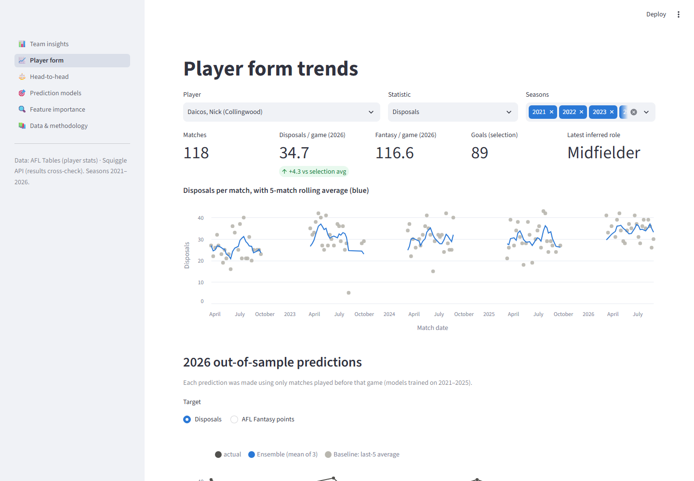
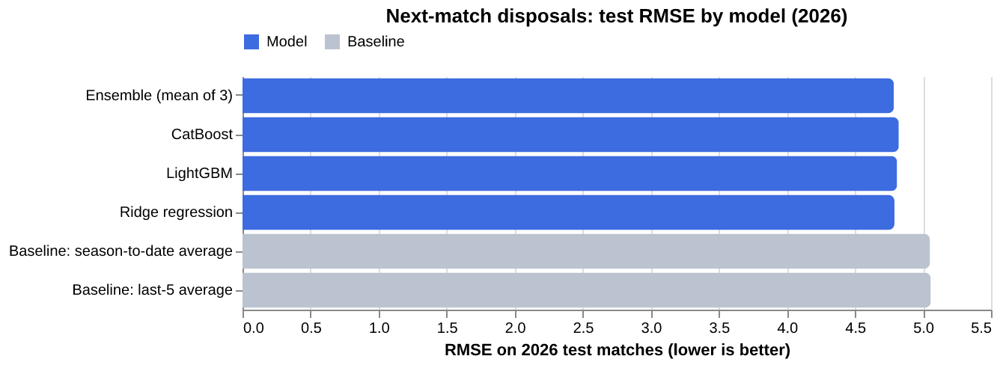
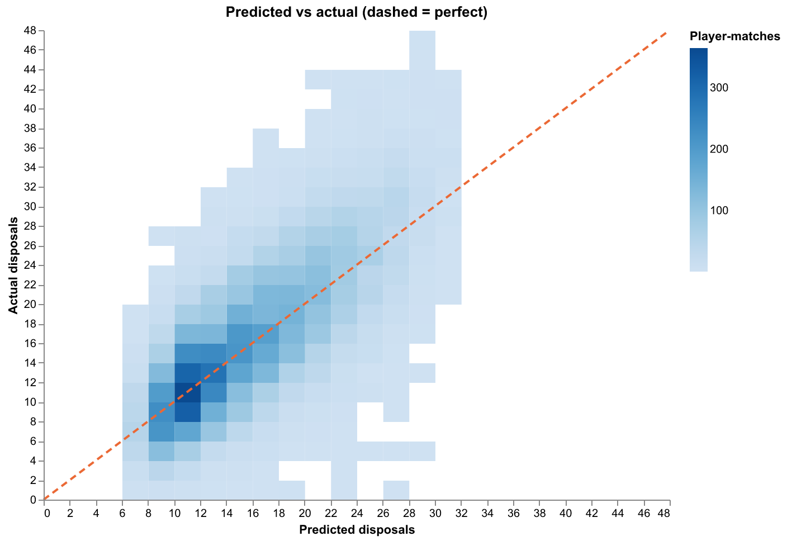
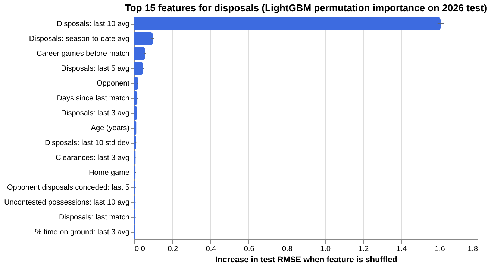
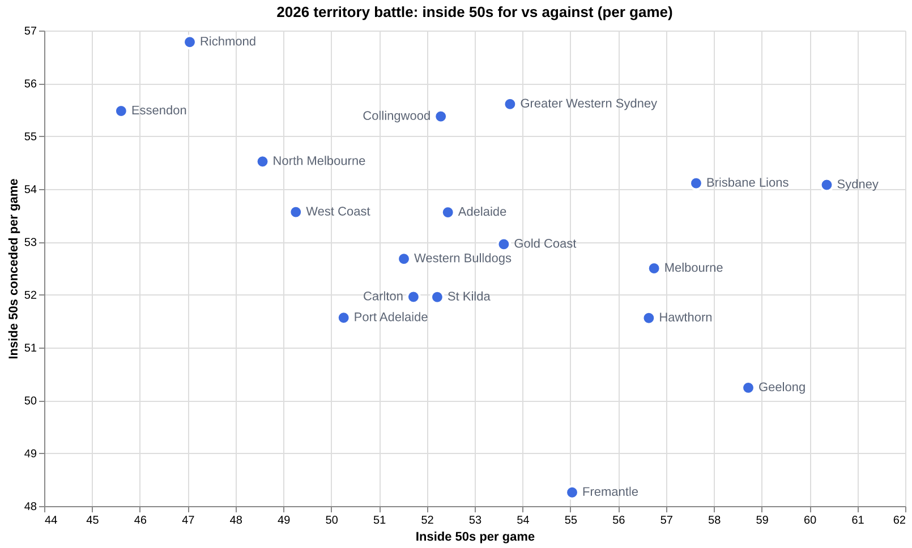
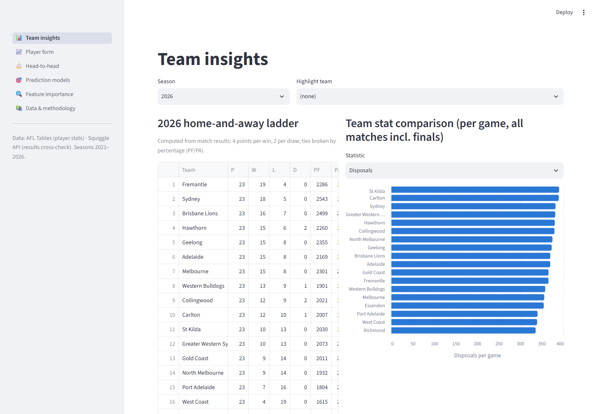
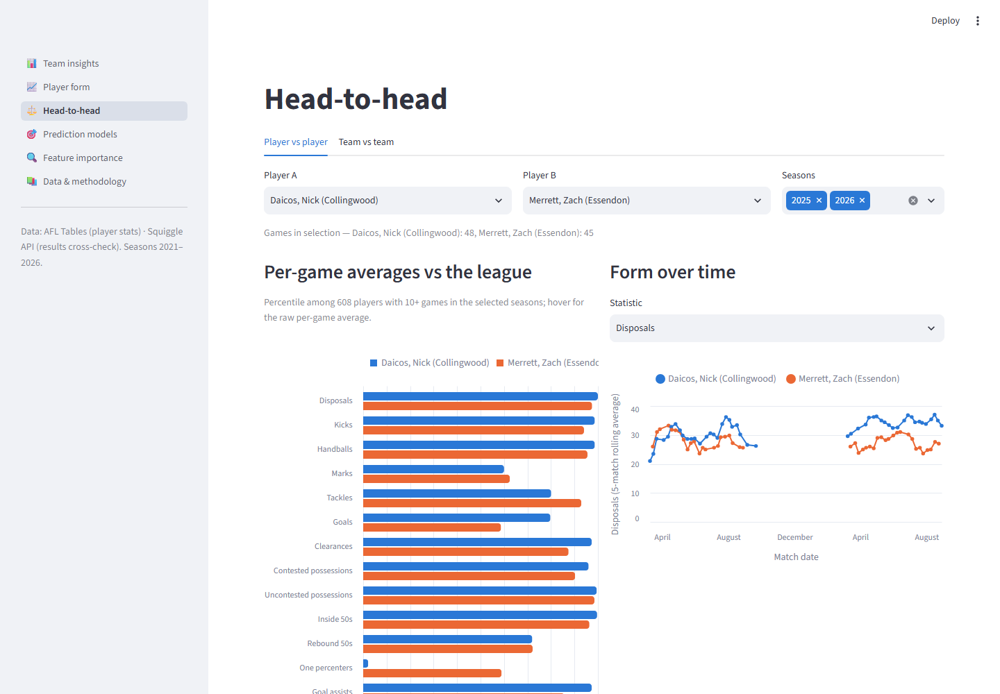
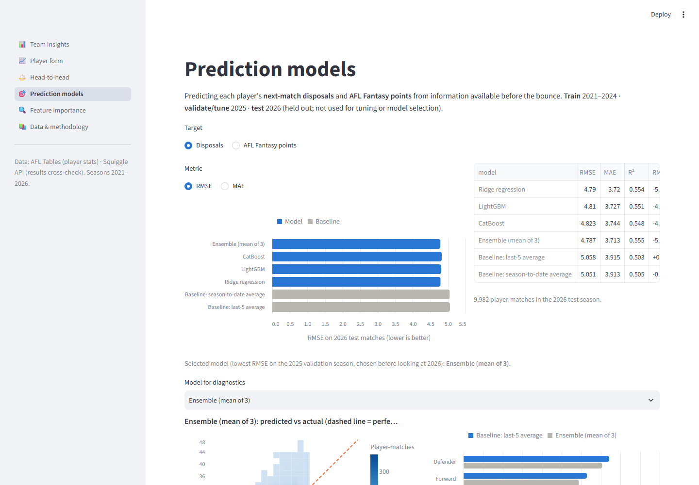
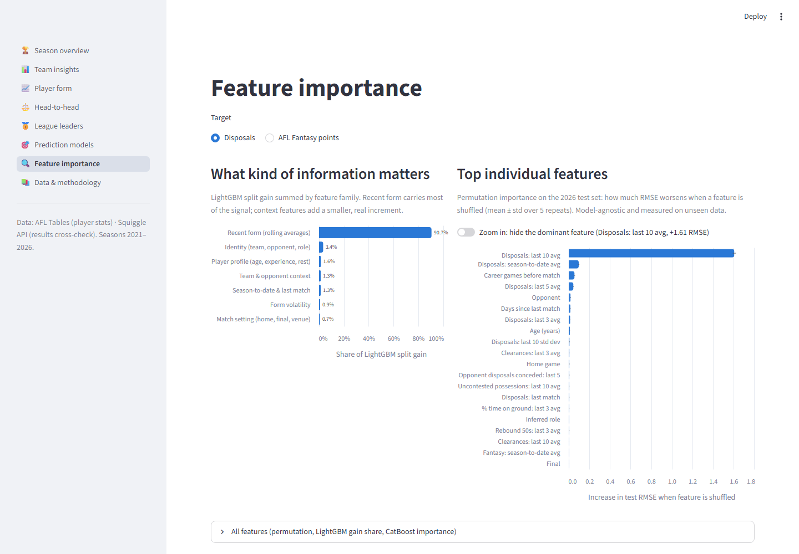

# AFL Player Performance Analytics & Prediction

An end-to-end data project on **real AFL data, 2021–2026**. It covers polite data collection, validation against independent sources, leakage-free feature engineering, a time-based comparison of several models against naive baselines, and an interactive dashboard.

**Live dashboard:** _link added after deployment_ (see [Deployment](#deployment))



## The problem

Can we predict how many **disposals** and **AFL Fantasy points** a player will record in their *next* match, using only what is known before the bounce? And how much better than "just use their recent average" can we do?

The dashboard also supports the analyst questions around that:

- Which teams win the territory battle?
- How is a player's form trending?
- How do two players compare against the league?

## Key results (2026 season, held-out test set: 9,982 player-matches)

| Target | Model (selected on 2025) | RMSE | MAE | R² | RMSE vs last-5 baseline |
|---|---|---|---|---|---|
| Disposals | Ensemble (Ridge + LightGBM + CatBoost) | **4.79** | **3.71** | 0.555 | **−5.4%** (baseline 5.06) |
| AFL Fantasy points | Ensemble (Ridge + LightGBM + CatBoost) | **20.68** | **16.23** | 0.380 | **−6.4%** (baseline 22.08) |

- **Every model beats both naive baselines** (last-5 average and season-to-date average) on both targets. All three models finish close together, which suggests the remaining error is mostly irreducible match-to-match noise rather than missing model capacity.
- **The gains hold for every inferred role.** The biggest gain is for forwards: disposals MAE 2.94 vs 3.15, fantasy points MAE 16.5 vs 18.1. Gains also hold for established full-match players only: disposals RMSE 4.79 vs 5.07.
- **What matters most** (permutation importance on unseen 2026 data):
  - The 10-match form average dominates.
  - Season-to-date average and career experience come next.
  - Opponent and home ground add a small, measurable signal.

| | |
|---|---|
|  |  |
|  |  |

## Data sources and licences

| Source | Used for | Terms / licence | Collected |
|---|---|---|---|
| [AFL Tables](https://afltables.com/afl/afl_index.html) | Per-player match statistics: 23 stats plus age and career games for every match, 2021–2026 | No robots.txt (returns 404) and no published terms of use or licence. The statistics are factual match records; site content © AFL Tables. This repo redistributes only derived, processed tables, with attribution, for non-commercial educational use. Raw HTML is not redistributed. | 3 Oct 2026 |
| [Squiggle API](https://api.squiggle.com.au/) | Independent check of every match's goals, behinds and score | Free and open ("may use the API for commercial purposes … no warranty"). Requires an identifying User-Agent, caching and no excessive requests. All of these were followed: one cached request per season. | 3 Oct 2026 |

**Sources considered and rejected:**

- **Footywire:** its robots.txt disallows `/fw/web/ft_match_statistics`, the player match-stats pages.
- **AFL.com.au and Champion Data:** the AFL Player Ratings and positions are proprietary and need an authenticated API.

As a result, **AFL Player Ratings are not included**. Instead the project uses **AFL Fantasy points** (computed from the real stats with the official scoring) and an **inferred playing role**. Both are clearly labelled as derived.

**Collection etiquette:**

- Single-threaded, at least 2.5 s between requests.
- A descriptive User-Agent pointing to this repository.
- Every page cached on disk and never re-fetched.
- About 1,290 requests in total.

## Data validation

Full report: [`reports/VALIDATION.md`](reports/VALIDATION.md) (machine-readable: `reports/validation.json`). Nothing was imputed, simulated or padded.

| Check | Result |
|---|---|
| Games per season vs Squiggle and fixture structure (207, 207, 216, 216, 216, 218) | ✅ all 6 seasons match |
| Every match joined to Squiggle; goals, behinds and scores compared | ✅ 1,280 matched. 1 conflict by a single behind (below). |
| Grand Final results 2021–2025 vs official results | ✅ all match |
| Minor premiers (ladder computed from results) 2021–2025 | ✅ Melbourne, Geelong, Collingwood, Sydney, Adelaide |
| Home-and-away games per team (22 in 2021–22, 23 in 2023–26) | ✅ |
| Player stats summed per team vs the page's own team totals (22 stats × 2,560 team-matches) | ✅ 0 mismatches |
| Final score rebuilt from player goals + behinds + rushed behinds | ✅ 0 mismatches |
| Disposals = kicks + handballs; duplicates; time-on-ground range | ✅ 0 violations |
| Outliers | Reviewed and kept (e.g. Harry Sheezel's 54 disposals in 2025 R24 is a real record) |

**Anomalies and how they were handled** (rule-based, in [`src/afl/clean.py`](src/afl/clean.py)):

- **Source conflict: Essendon v Port Adelaide, 23 Aug 2026.**
  - AFL Tables records Port 16.9 (105); Squiggle records 16.8 (104).
  - AFL Tables is internally consistent and agrees with Port Adelaide FC's match report.
  - Values were kept and the 46 rows flagged `source_conflict`. Those rows are **excluded from all evaluation metrics**.
- **Unverifiable substitution markers: Gold Coast v Essendon, 27 Aug 2025** (the Opening Round match postponed by Cyclone Alfred).
  - AFL Tables marks 2 and 3 substitutions, but match reports describe one per side.
  - Substitution markers for that match were set to null (unknown). The stats themselves are untouched.
- **400 named substitutes who never took the field.** They are kept in the raw table (`took_field = false`) and excluded from modelling.

## Methodology

```
scrape (AFL Tables, cached) → parse (selectolax → Parquet) → validate (DuckDB SQL vs Squiggle & internal totals)
  → clean (rule-based flags) → features (Polars, strictly pre-match) → train (Ridge / LightGBM / CatBoost)
  → figures + Streamlit dashboard
```

- **Dataset:** 1,280 matches, 58,880 player-match rows, 1,124 players. 58,480 rows are used for modelling (players who took the field).
- **Features:** 68 in total, all computed only from matches *before* the one being predicted (`shift(1)` per player).
  - Rolling 3/5/10-match averages of 16 stats, form volatility, last match and season-to-date averages.
  - Age, career games, days since last match, whether the player was a substitute last match.
  - Team and opponent rolling context: team disposals, and opponent disposals and fantasy points conceded.
  - Home/away, finals, team, opponent and venue.
  - **Inferred role:** k-means clustering of each player's prior 10-match profile, fitted on the training seasons only. Ruck / Midfielder / Forward / Defender / Wing-Utility.
- **Time-based split:**
  - Train 2021–2024.
  - Validate 2025: Ridge alpha, LightGBM grid, early stopping, and model selection.
  - Refit on 2021–2025, then test on 2026.
- **Baselines:** the player's last-5-match average and season-to-date average.
- **Metrics:** RMSE, MAE and R². Also broken down by inferred role and for full-match established players.

More detail: [`docs/methodology.md`](docs/methodology.md).

## Dashboard pages

| Page | What it shows |
|---|---|
| **Team insights** | Home-and-away ladder computed from results; per-game team stat comparison; territory chart (inside 50s for vs against) |
| **Player form** | Per-match values with a 5-match rolling average for any stat; season averages; match log; 2026 out-of-sample predictions vs actual |
| **Head-to-head** | Player vs player: percentile ranks against the league plus form overlay. Team vs team: meetings, wins, average margin. |
| **Prediction models** | Test RMSE and MAE for all models vs baselines; predicted vs actual (binned density); error by role |
| **Feature importance** | Permutation importance on the 2026 test set (with spread over 5 repeats), LightGBM gain and CatBoost importance |
| **Data & methodology** | Sources, derived quantities, validation summary |

| | |
|---|---|
|  |  |
|  |  |

## Stack (and why)

| Tool | Why |
|---|---|
| **httpx** | Modern HTTP client with timeouts and retries for polite, cached collection |
| **selectolax** | Very fast HTML parser (a Lexbor binding); a lightweight alternative to BeautifulSoup |
| **Polars** | Fast, expressive DataFrames; window expressions (`shift().rolling_mean().over(player)`) make leakage-free features concise |
| **DuckDB** | SQL validation checks and the dashboard's query layer, run directly on Parquet files |
| **scikit-learn** | Ridge baseline model, preprocessing pipelines, k-means role inference, permutation importance |
| **LightGBM** | Fast gradient boosting with native categorical support |
| **CatBoost** | Gradient boosting with ordered target statistics for high-cardinality categoricals (team, opponent, venue) |
| **Streamlit + Altair** | Pure-Python interactive dashboard, with Altair charts declared exactly; the same chart code exports the README figures (via vl-convert) |

## Limitations (honest summary)

- **The ceiling is low by nature.** Single-match player output is noisy: role changes, injuries mid-game, tags and weather. A 5–6% RMSE gain over a strong recent-form baseline is meaningful, but individual predictions are still often off by about 4–5 disposals.
- **No positions or official ratings.** Free sources don't publish them, so roles are *inferred* from stats and AFL Player Ratings are absent.
- **Team selection is assumed known.** Predictions are made for players who actually played. A real pre-game system would also need to handle late changes and the named substitute, whose minutes are uncertain.
- **Test-set use.** All tuning and model selection used 2025 only. The 2026 test set was scored twice during development: once for the initial three models, then again after adding the LightGBM grid, a wider Ridge alpha range (alpha had hit the edge of the first grid on validation) and the ensemble. The selected model and its rank did not depend on 2026, but this is disclosed for transparency.
- **Coverage starts in 2021.** Rolling features for early-2021 matches have shorter histories, and pre-2021 career form is not used apart from career games played.
- **Single primary source** for player stats. It is cross-checked against Squiggle for scores and against its own team totals, but player-level stats have no second free source to compare against.

## How to run

```bash
python -m venv .venv
.venv\Scripts\activate            # macOS/Linux: source .venv/bin/activate
pip install -r requirements-pipeline.txt

# Full pipeline. The first run downloads about 1,280 pages politely (about 1 hour); later runs use the cache.
python scripts/run_pipeline.py

# Or step by step:
set PYTHONPATH=src                # macOS/Linux: export PYTHONPATH=src
python -m afl.scrape && python -m afl.parse && python -m afl.validate && python -m afl.clean
python -m afl.features && python -m afl.train && python -m afl.figures

# Dashboard (only needs requirements.txt plus the committed data/processed files)
streamlit run app/streamlit_app.py
```

## Repository layout

```
app/streamlit_app.py      Streamlit dashboard (6 pages)
src/afl/                  scrape · parse · squiggle · validate · clean · features · train · charts · figures
scripts/                  run_pipeline.py, screenshots.py
data/processed/           Parquet tables used by the dashboard (raw HTML cache is git-ignored)
reports/                  VALIDATION.md, validation.json, cleaning.json
results/                  metrics.json, feature_importance.parquet, role_centroids.json
docs/                     methodology, README figures and screenshots
```

## Deployment

The dashboard runs on **Streamlit Community Cloud** (free). The main file is `app/streamlit_app.py`, and Python dependencies come from `requirements.txt`.

## Licence

Code: MIT (see [LICENSE](LICENSE)). Data: subject to the original sources' terms, listed above.
